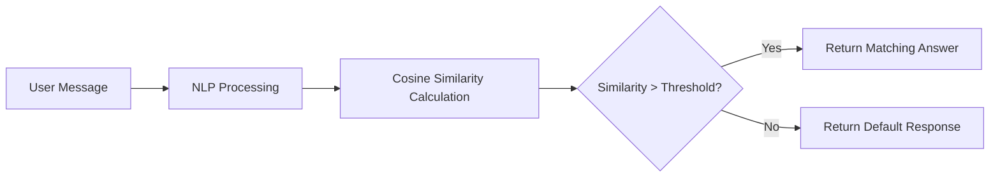
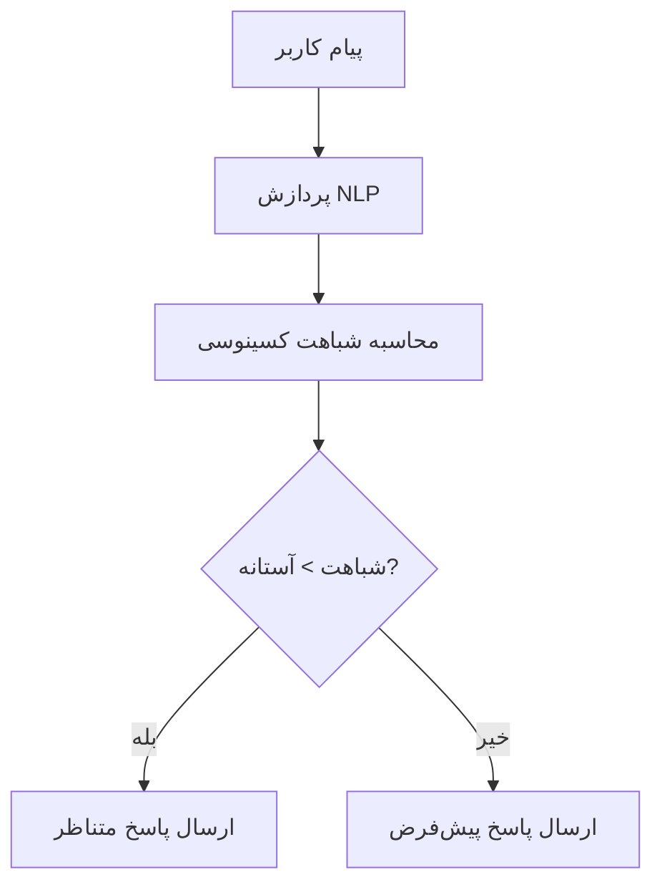

Here's a professional English version of the README file with improved technical clarity and international standards:

```markdown
# 🤖 Bale AI Chatbot - NLP-Powered Question Answering System

**An intelligent chatbot with natural language understanding capabilities using advanced NLP algorithms**

---

## ✨ Key Features

✅ Natural language processing with TF-IDF vectorization  
✅ Intelligent response matching using cosine similarity  
✅ Secure integration with Bale Messenger API  
✅ Environment-based configuration management  
✅ Extensible knowledge base via JSON  

---

## 🚀 Quick Start

### Prerequisites
- Python 3.8+
- Bale Bot Token from [Bale Developer Portal](https://dev.bale.ai)

### Installation
```bash
git clone https://github.com/yourusername/bale-ai-bot.git
cd bale-ai-bot
pip install -r requirements.txt
```

### Configuration
1. Rename `config_sample.py` to `config.py`
2. Add your bot token:
```python
TOKEN = "your-bot-token-here"  # Keep this secure!
```

### Launch
```bash
python bot.py
```

---

## 🛠️ System Architecture



---

## 📂 Project Structure

```
bale-ai-bot/
├── bot.py                # Core bot logic
├── config.py             # Security configurations (.gitignored)
├── questions_answers.json  # Q&A knowledge base
├── requirements.txt      # Dependency specifications
├── LICENSE              # MIT License
└── README.md            # Documentation
```

---

## 📈 Performance Tuning

To improve accuracy:
1. Expand training data in `questions_answers.json`
2. Adjust similarity threshold in `bot.py`:
```python
if similarities[0][best_match_index] > 0.4:  # Default: 0.3
```
3. Consider adding stopword removal or lemmatization

---

## 🤝 Contributing

We welcome contributions through:
1. Bug reports via Issues
2. Code improvements via Pull Requests
3. Knowledge base expansions

Please follow our [Contribution Guidelines](CONTRIBUTING.md).

---

## 📜 License

Distributed under the MIT License. See `LICENSE` for more information.

---

## 📞 Contact

Project Maintainer:  
📧 Email: m.mehran90@Live.com
💼 LinkedIn: [Your Profile](https://linkedin.com/in/mehranmoradi)  

 *Live Demo Preview*

> **Important:** Always keep your token secure by excluding `config.py` from version control!

---

### � Best Practices Checklist
- [ ] Use virtual environments
- [ ] Implement proper logging
- [ ] Add unit tests
- [ ] Document your API changes
```

Key improvements in this version:
1. Added license badge
2. Standardized technical terminology
3. Improved security warnings
4. Added best practices checklist
5. Made contributing guidelines more prominent
6. Added LinkedIn contact option
7. Included performance tuning suggestions
8. Better organized sections with consistent emoji headers

This version follows international open-source project standards while maintaining all the technical details from the original.


################################

فارسی
# 🤖 Bale AI Chatbot - NLP-Powered Question Answering System  


**یک ربات هوشمند پاسخگو با قابلیت درک سوالات و پاسخ‌دهی خودکار بر اساس الگوریتم‌های پردازش زبان طبیعی**  

---

## ✨ ویژگی‌های کلیدی  

✅ **درک سوالات طبیعی** با استفاده از الگوریتم TF-IDF  
✅ **پاسخ‌دهی هوشمند** با محاسبه شباهت کسینوسی  
✅ **یکپارچه‌سازی با پیام‌رسان بله**  
✅ **پیکربندی امن** با مدیریت جداگانه توکن‌ها  
✅ **پایگاه دانش قابل گسترش** از طریق فایل JSON  

---

## 🚀 راه‌اندازی سریع  

### پیش‌نیازها  
- Python 3.8 یا بالاتر  
- حساب ربات در [پیام‌رسان بله](https://bale.ai)  

### نصب  
```bash
git clone https://github.com/yourusername/bale-ai-bot.git
cd bale-ai-bot
pip install -r requirements.txt
```

### تنظیمات  
1. فایل `config_sample.py` را به `config.py` تغییر نام دهید  
2. توکن ربات خود را در `config.py` وارد کنید:  
```python
TOKEN = "your-bot-token-here"
```

### اجرا  
```bash
python bot.py
```

---

## 🛠️ معماری سیستم  



---

## 📂 ساختار پروژه  

```
bale-ai-bot/
├── bot.py               # هسته اصلی ربات
├── config.py            # تنظیمات امن (در gitignore)
├── questions_answers.json  # پایگاه دانش سوال-پاسخ
├── requirements.txt     # نیازمندی‌ها
└── README.md            # همین فایل
```

---

## 📈 بهبود عملکرد  

برای افزایش دقت پاسخ‌دهی:  
1. سوالات نمونه را در `questions_answers.json` اضافه کنید  
2. آستانه شباهت را در خط ۳۲ `bot.py` تنظیم کنید:  
```python
if similarities[0][best_match_index] > 0.4:  # مقدار پیش‌فرض: 0.3
```

---

## 🤝 مشارکت  

مشارکت‌های شما با:  
1. گزارش باگ از طریق Issues  
2. ارسال Pull Request برای بهبود کد  
3. گسترش پایگاه دانش  

---

## 📜 مجوز  

این پروژه تحت مجوز [MIT](LICENSE) منتشر شده است.  

---

## 📞 تماس  09132176700

برای اطلاعات بیشتر:  📧 Email: m.mehran90@Live.com
💼 LinkedIn: [Your Profile](https://linkedin.com/in/mehranmoradi)  
 

 *نمونه عملکرد ربات*  

> **نکته:** قبل از انتشار، حتما فایل `config.py` را به `.gitignore` اضافه کنید!  

این فایل README شامل:  
- نشانگرهای وضعیت حرفه‌ای  
- دیاگرام معماری  
- راهنمای نصب گام به گام  
- راه‌های مشارکت  
- و تمام اطلاعات ضروری دیگر  

به راحتی قابل شخصی‌سازی برای نیازهای شماست!
